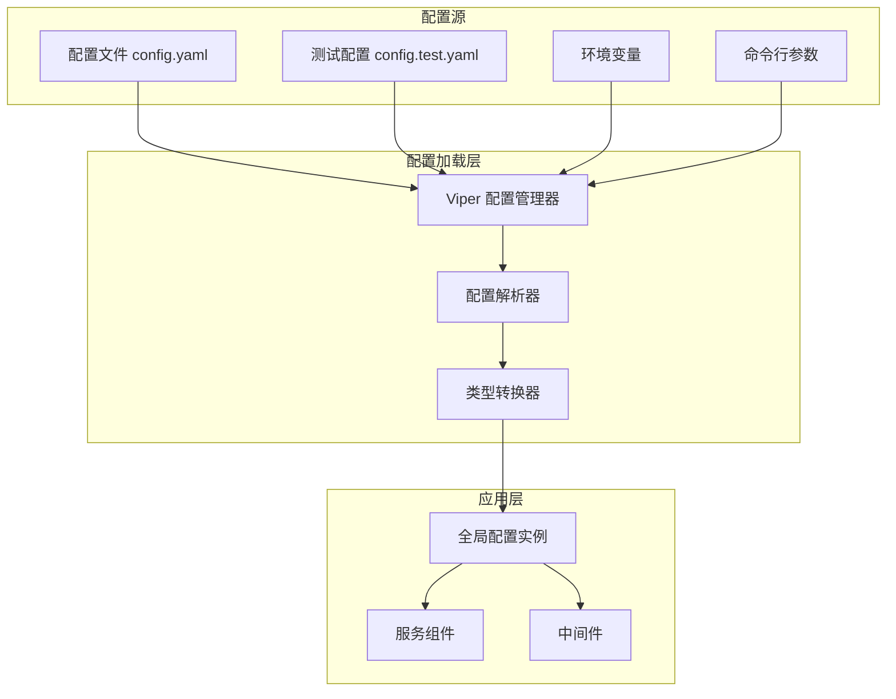
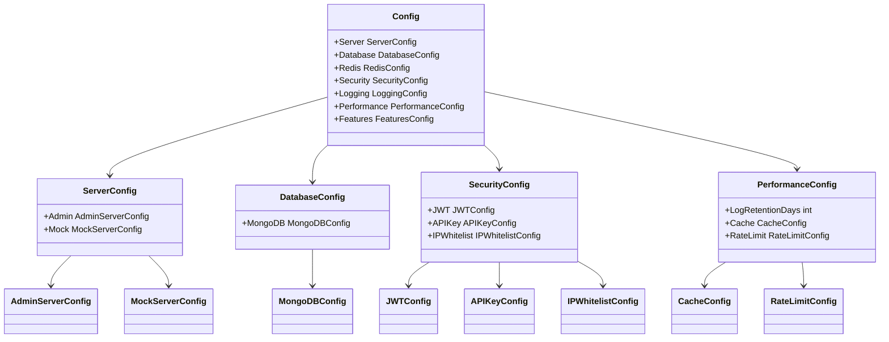
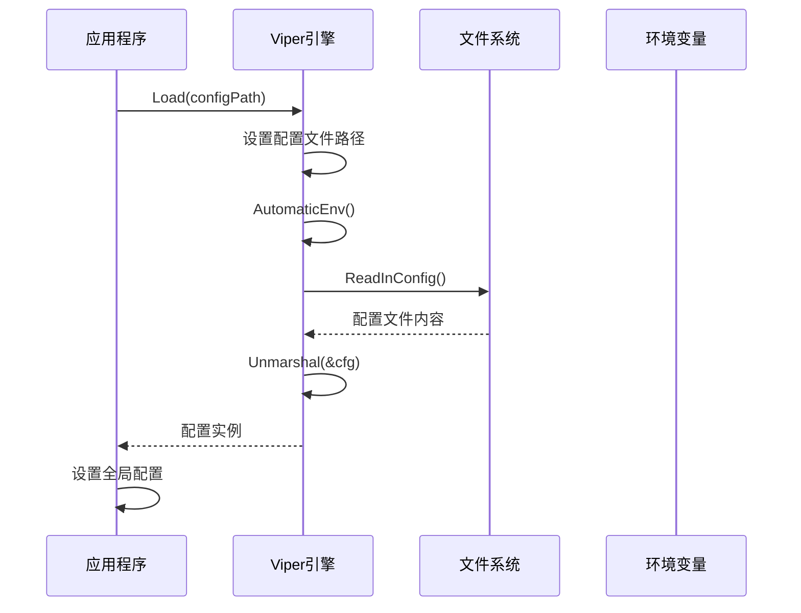

# 配置管理

<cite>
**本文档中引用的文件**
- [config.yaml](file://config.yaml)
- [config.test.yaml](file://config.test.yaml)
- [internal/config/config.go](file://internal/config/config.go)
- [internal/config/config_test.go](file://internal/config/config_test.go)
- [go.mod](file://go.mod)
- [internal/cache/redis_cluster.go](file://internal/cache/redis_cluster.go)
</cite>

## 目录
1. [简介](#简介)
2. [配置系统架构](#配置系统架构)
3. [配置文件结构](#配置文件结构)
4. [环境配置](#环境配置)
5. [配置加载机制](#配置加载机制)
6. [安全配置](#安全配置)
7. [性能配置](#性能配置)
8. [功能开关](#功能开关)
9. [配置最佳实践](#配置最佳实践)
10. [故障排除](#故障排除)

## 简介

Gomockserver 使用 Viper 库实现强大的配置管理系统，支持多环境配置、环境变量覆盖、配置热重载等功能。该系统采用 YAML 格式配置文件，提供了灵活且可扩展的配置解决方案。

## 配置系统架构



**图表来源**
- [internal/config/config.go](file://internal/config/config.go#L137-L167)

**章节来源**
- [internal/config/config.go](file://internal/config/config.go#L1-L183)

## 配置文件结构

### 主要配置结构

配置系统采用分层结构设计，主要包含以下配置模块：



**图表来源**
- [internal/config/config.go](file://internal/config/config.go#L10-L18)

### 服务器配置

| 配置项 | 类型 | 默认值 | 描述 |
|--------|------|--------|------|
| server.admin.host | string | "0.0.0.0" | 管理 API 服务绑定地址 |
| server.admin.port | int | 8080 | 管理 API 服务端口号 |
| server.mock.host | string | "0.0.0.0" | Mock 服务绑定地址 |
| server.mock.port | int | 9090 | Mock 服务端口号 |

### 数据库配置

| 配置项 | 类型 | 默认值 | 描述 |
|--------|------|--------|------|
| database.mongodb.uri | string | "mongodb://mongodb:27017" | MongoDB 连接字符串 |
| database.mongodb.database | string | "mockserver" | 数据库名称 |
| database.mongodb.timeout | duration | 10s | 连接超时时间 |
| database.mongodb.pool.min | int | 10 | 最小连接数 |
| database.mongodb.pool.max | int | 100 | 最大连接数 |

### Redis 配置

| 配置项 | 类型 | 默认值 | 描述 |
|--------|------|--------|------|
| redis.enabled | bool | false | 是否启用 Redis |
| redis.host | string | "localhost" | Redis 主机地址 |
| redis.port | int | 6379 | Redis 端口号 |
| redis.password | string | "" | Redis 密码 |
| redis.db | int | 0 | 数据库编号 |
| redis.pool.min | int | 5 | 最小连接数 |
| redis.pool.max | int | 50 | 最大连接数 |

**章节来源**
- [config.yaml](file://config.yaml#L3-L91)
- [internal/config/config.go](file://internal/config/config.go#L10-L183)

## 环境配置

### 开发环境配置

开发环境使用默认的 `config.yaml` 文件，适用于本地开发和调试：

```yaml
# 开发环境配置示例
server:
  admin:
    host: "0.0.0.0"
    port: 8080
  mock:
    host: "0.0.0.0"
    port: 9090

database:
  mongodb:
    uri: "mongodb://localhost:27017"
    database: "mockserver_dev"
    timeout: 10s
    pool:
      min: 5
      max: 50

security:
  jwt:
    secret: "development-secret-key"
    expiration: 7200
```

### 测试环境配置

测试环境使用 `config.test.yaml` 文件，具有不同的数据库和更宽松的配置：

```yaml
# 测试环境配置示例
server:
  admin:
    host: "0.0.0.0"
    port: 8080
  mock:
    host: "0.0.0.0"
    port: 9090

database:
  mongodb:
    uri: "mongodb://localhost:27017"
    database: "mockserver_test"
    timeout: 10s
    pool:
      min: 2
      max: 20

logging:
  level: "debug"
  format: "json"
  output: "stdout"
```

### 生产环境配置

生产环境应使用以下配置原则：

```yaml
# 生产环境配置示例
server:
  admin:
    host: "0.0.0.0"
    port: 8080
  mock:
    host: "0.0.0.0"
    port: 9090

database:
  mongodb:
    uri: "mongodb://production-db:27017"
    database: "mockserver_prod"
    timeout: 10s
    pool:
      min: 20
      max: 200

security:
  jwt:
    secret: "CHANGE_TO_SECURE_RANDOM_STRING"
    expiration: 7200
  api_key:
    enabled: true
  ip_whitelist:
    enabled: true
    ips: ["192.168.1.0/24", "10.0.0.0/8"]

logging:
  level: "info"
  format: "json"
  output: "file"
  file:
    path: "/var/log/mockserver/prod.log"
    max_size: 100
    max_backups: 10
    max_age: 30
```

**章节来源**
- [config.yaml](file://config.yaml#L1-L91)
- [config.test.yaml](file://config.test.yaml#L1-L80)

## 配置加载机制

### 配置加载优先级

Viper 配置系统遵循以下优先级顺序（从高到低）：


**图表来源**
- [internal/config/config.go](file://internal/config/config.go#L141-L157)

### 配置加载流程



**图表来源**
- [internal/config/config.go](file://internal/config/config.go#L137-L167)

### 配置文件发现机制

配置系统会按以下顺序查找配置文件：

1. 用户指定的配置文件路径
2. 当前目录下的 `config.yaml`
3. `./config/` 目录下的 `config.yaml`

**章节来源**
- [internal/config/config.go](file://internal/config/config.go#L137-L167)

## 安全配置

### JWT 安全配置

JWT 配置是系统的核心安全组件：

| 配置项 | 类型 | 默认值 | 安全建议 |
|--------|------|--------|----------|
| security.jwt.secret | string | "your-secret-key-change-in-production" | 使用强随机字符串，定期轮换 |
| security.jwt.expiration | int | 7200 | 根据业务需求调整，建议 1-24 小时 |

### API 密钥配置

```yaml
security:
  api_key:
    enabled: true  # 生产环境启用
```

### IP 白名单配置

```yaml
security:
  ip_whitelist:
    enabled: true
    ips: ["192.168.1.0/24", "10.0.0.0/8", "203.0.113.5"]
```

### TLS/SSL 配置

虽然主配置文件中没有直接的 TLS 配置，但系统支持 Redis 集群的 TLS 连接：

```yaml
redis:
  enabled: true
  tls_config:
    enabled: true
    insecure_skip_verify: false
    cert_file: "/path/to/client.crt"
    key_file: "/path/to/client.key"
    ca_file: "/path/to/ca.crt"
```

**章节来源**
- [config.yaml](file://config.yaml#L35-L47)
- [internal/cache/redis_cluster.go](file://internal/cache/redis_cluster.go#L77-L85)

## 性能配置

### 缓存配置

| 配置项 | 类型 | 默认值 | 性能影响 |
|--------|------|--------|----------|
| performance.cache.rule_ttl | int | 300 | 规则缓存时间（秒） |
| performance.cache.config_ttl | int | 1800 | 配置缓存时间（秒） |

### 限流配置

```yaml
performance:
  rate_limit:
    enabled: true
    ip_limit: 1000  # 每分钟请求数
    global_limit: 10000  # 每秒全局请求数
```

### 上下文超时配置

| 配置项 | 类型 | 默认值 | 用途 |
|--------|------|--------|------|
| performance.timeout.default | duration | 30s | 默认请求超时 |
| performance.timeout.database_query | duration | 10s | 数据库查询超时 |
| performance.timeout.database_write | duration | 15s | 数据库写入超时 |
| performance.timeout.health_check | duration | 2s | 健康检查超时 |

### 日志保留策略

```yaml
performance:
  log_retention_days: 7  # 请求日志保留天数
```

**章节来源**
- [config.yaml](file://config.yaml#L60-L82)

## 功能开关

### 版本控制

```yaml
features:
  version_control: true  # 启用规则版本控制
```

### 审计日志

```yaml
features:
  audit_log: true  # 启用审计日志记录
```

### 监控指标

```yaml
features:
  metrics: true  # 启用 Prometheus 指标收集
```

**章节来源**
- [config.yaml](file://config.yaml#L83-L91)

## 配置最佳实践

### 敏感信息保护

1. **不要在配置文件中存储明文密码**
   ```bash
   # 推荐方式
   export DATABASE_PASSWORD="secure_password"
   ```

2. **使用环境变量覆盖敏感配置**
   ```bash
   export SECURITY_JWT_SECRET="production_secret_key"
   export REDIS_PASSWORD="redis_secure_password"
   ```

3. **配置文件权限设置**
   ```bash
   chmod 600 config.yaml
   chown app:app config.yaml
   ```

### 多环境配置管理

1. **使用环境变量区分环境**
   ```bash
   # 开发环境
   export ENVIRONMENT=development
   
   # 生产环境  
   export ENVIRONMENT=production
   export CONFIG_PATH=/etc/mockserver/config.yaml
   ```

2. **配置模板化**
   ```yaml
   # config.template.yaml
   server:
     admin:
       host: ${SERVER_HOST:-0.0.0.0}
       port: ${SERVER_PORT:-8080}
   
   database:
     mongodb:
       uri: ${DATABASE_URI:-mongodb://localhost:27017}
       database: ${DATABASE_NAME:-mockserver}
   ```

### 配置验证

```go
// 配置验证示例
func validateConfig(cfg *Config) error {
    if cfg.Security.JWT.Secret == "your-secret-key-change-in-production" {
        return fmt.Errorf("JWT secret not changed from default")
    }
    
    if cfg.Database.MongoDB.Pool.Min > cfg.Database.MongoDB.Pool.Max {
        return fmt.Errorf("min pool size cannot be greater than max pool size")
    }
    
    return nil
}
```

### 配置热重载

虽然当前实现不支持自动热重载，但可以通过以下方式实现：

```go
// 热重载示例
func watchConfigChanges(configPath string) {
    watcher, err := fsnotify.NewWatcher()
    if err != nil {
        logger.Error("Failed to create watcher", zap.Error(err))
        return
    }
    defer watcher.Close()
    
    done := make(chan bool)
    go func() {
        for {
            select {
            case event, ok := <-watcher.Events:
                if !ok {
                    return
                }
                if event.Op&fsnotify.Write == fsnotify.Write {
                    logger.Info("Config file changed, reloading...")
                    newCfg, err := Load(configPath)
                    if err != nil {
                        logger.Error("Failed to reload config", zap.Error(err))
                        continue
                    }
                    // 更新全局配置
                    globalConfig = newCfg
                    logger.Info("Config reloaded successfully")
                }
            case err, ok := <-watcher.Errors:
                if !ok {
                    return
                }
                logger.Error("Config watch error", zap.Error(err))
            }
        }
    }()
    
    err = watcher.Add(filepath.Dir(configPath))
    if err != nil {
        logger.Error("Failed to watch config directory", zap.Error(err))
    }
    
    <-done
}
```

## 故障排除

### 常见配置问题

1. **配置文件找不到**
   ```
   Error: failed to read config file: open config.yaml: no such file or directory
   ```
   **解决方法**: 确认配置文件路径，或使用 `-config` 参数指定路径

2. **YAML 格式错误**
   ```
   Error: failed to unmarshal config: yaml: line 15: mapping values are not allowed in this context
   ```
   **解决方法**: 检查 YAML 缩进和语法

3. **端口冲突**
   ```
   Error: listen tcp :8080: bind: address already in use
   ```
   **解决方法**: 修改配置文件中的端口号或停止占用端口的服务

### 配置调试

1. **启用调试日志**
   ```yaml
   logging:
     level: "debug"
     format: "text"
   ```

2. **验证配置加载**
   ```go
   cfg, err := Load("")
   if err != nil {
       log.Fatalf("Failed to load config: %v", err)
   }
   log.Printf("Loaded config: %+v", cfg)
   ```

3. **检查环境变量**
   ```bash
   # 显示所有以 MOCKSERVER 开头的环境变量
   env | grep MOCKSERVER
   ```

### 性能优化配置

1. **数据库连接池优化**
   ```yaml
   database:
     mongodb:
       pool:
         min: 10  # 根据并发需求调整
         max: 100
   ```

2. **Redis 连接池优化**
   ```yaml
   redis:
     pool:
       min: 10
       max: 100
   ```

3. **缓存 TTL 调整**
   ```yaml
   performance:
     cache:
       rule_ttl: 600  # 10分钟
       config_ttl: 3600  # 1小时
   ```

**章节来源**
- [internal/config/config_test.go](file://internal/config/config_test.go#L1-L593)