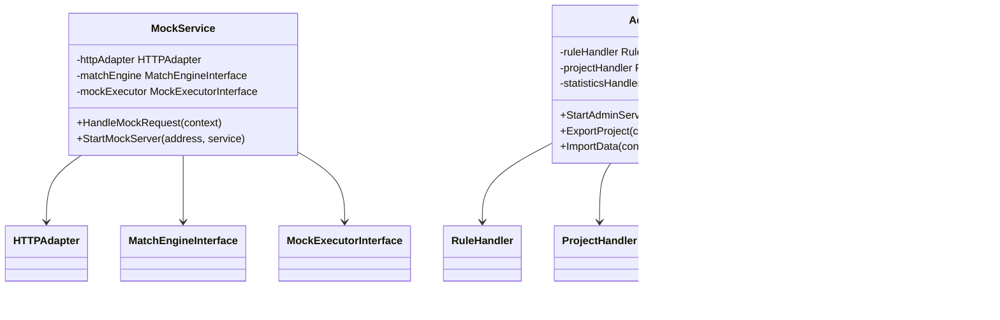

# 项目概述

<cite>
**本文档中引用的文件**
- [README.md](file://README.md)
- [PROJECT_SUMMARY.md](file://PROJECT_SUMMARY.md)
- [config.yaml](file://config.yaml)
- [go.mod](file://go.mod)
- [internal/config/config.go](file://internal/config/config.go)
- [internal/adapter/http_adapter.go](file://internal/adapter/http_adapter.go)
- [internal/engine/match_engine.go](file://internal/engine/match_engine.go)
- [internal/executor/mock_executor.go](file://internal/executor/mock_executor.go)
- [internal/service/mock_service.go](file://internal/service/mock_service.go)
- [internal/service/admin_service.go](file://internal/service/admin_service.go)
- [internal/service/middleware.go](file://internal/service/middleware.go)
- [internal/models/models.go](file://internal/models/models.go)
- [internal/api/project_handler.go](file://internal/api/project_handler.go)
- [internal/api/rule_handler.go](file://internal/api/rule_handler.go)
</cite>

## 目录
1. [项目简介](#项目简介)
2. [核心特性](#核心特性)
3. [应用场景](#应用场景)
4. [整体架构](#整体架构)
5. [核心组件分析](#核心组件分析)
6. [技术优势](#技术优势)
7. [设计哲学](#设计哲学)
8. [与其他Mock工具的差异化](#与其他mock工具的差异化)
9. [部署架构](#部署架构)
10. [总结](#总结)

## 项目简介

Mock Server是一个功能强大、灵活可配置的企业级接口模拟系统，专为现代软件开发和测试场景设计。作为一个多协议支持的HTTP Mock服务，它提供了完整的RESTful API模拟能力，支持复杂的规则匹配、动态响应生成和可观测性支持。

该项目采用现代化的微服务架构设计，支持HTTP/HTTPS、WebSocket等多种协议，具备企业级的项目管理、环境隔离和权限控制功能。通过分层架构实现了高度的模块化和可扩展性，为开发团队提供了完整的Mock解决方案。

**Section sources**
- [README.md](file://README.md#L1-L223)
- [PROJECT_SUMMARY.md](file://PROJECT_SUMMARY.md#L1-L253)

## 核心特性

### 协议支持矩阵

Mock Server提供全面的协议支持，满足不同场景的Mock需求：

- **HTTP/HTTPS**: 完整的RESTful API Mock能力，支持所有HTTP方法和自定义状态码
- **WebSocket**: 实时双向通信支持，1000+并发连接管理
- **代理模式**: HTTP反向代理，支持请求/响应修改和延迟注入

### 智能匹配引擎

系统具备强大的规则匹配能力，支持多种匹配策略：

- **简单匹配**: 路径、方法、Header、Query参数的精确匹配
- **正则表达式**: LRU缓存优化的复杂模式匹配
- **脚本匹配**: JavaScript引擎，安全沙箱隔离（规划中）

### 动态响应系统

提供灵活的响应生成机制：

- **模板引擎**: Go template，13个内置函数
- **静态响应**: JSON、XML、HTML、二进制数据支持
- **文件引用**: 流式大文件支持
- **高级延迟**: 固定、随机、正态分布、阶梯延迟

**Section sources**
- [README.md](file://README.md#L9-L31)
- [PROJECT_SUMMARY.md](file://PROJECT_SUMMARY.md#L11-L52)

## 应用场景

### 开发联调场景

Mock Server在开发联调过程中发挥关键作用：

- **接口未完成**: 当上游服务尚未开发完成时，提供稳定的Mock接口
- **接口变更**: 在接口规范变更期间，确保下游系统稳定运行
- **第三方集成**: 对接第三方服务时，提供可控的测试环境

### 测试环境构建

为测试团队提供完整的测试基础设施：

- **单元测试**: 为独立模块提供Mock依赖
- **集成测试**: 模拟复杂的服务交互场景
- **压力测试**: 在高并发场景下验证系统性能
- **回归测试**: 确保接口行为的一致性

### API原型验证

在API设计阶段提供快速验证能力：

- **概念验证**: 快速验证API设计的可行性
- **用户体验**: 为前端开发提供真实的接口响应
- **文档同步**: 通过Mock服务验证API文档的准确性

## 整体架构

### 分层架构设计

Mock Server采用经典的分层架构模式，确保了良好的可维护性和扩展性：

**图表来源**
- [internal/service/admin_service.go](file://internal/service/admin_service.go#L15-L37)
- [internal/service/mock_service.go](file://internal/service/mock_service.go#L25-L38)
- [internal/engine/match_engine.go](file://internal/engine/match_engine.go#L26-L40)
- [internal/executor/mock_executor.go](file://internal/executor/mock_executor.go#L21-L46)

### 关键入口点

系统提供三个主要的入口点，分别服务于不同的使用场景：

- **管理API端口 (8080)**: 提供完整的项目管理和规则配置功能
- **Mock服务端口 (9090)**: 专门用于接收和处理Mock请求
- **Web管理界面**: 通过浏览器访问的可视化管理平台

**Section sources**
- [config.yaml](file://config.yaml#L4-L11)
- [PROJECT_SUMMARY.md](file://PROJECT_SUMMARY.md#L150-L171)

## 核心组件分析

### HTTP适配器 (HTTP Adapter)

HTTP适配器负责协议转换和请求标准化，是系统与外部通信的桥梁：

**图表来源**
- [internal/adapter/http_adapter.go](file://internal/adapter/http_adapter.go#L13-L113)

HTTP适配器的主要职责包括：
- **请求解析**: 将HTTP请求转换为统一的请求模型
- **响应构建**: 将统一的响应模型转换为HTTP响应
- **元数据提取**: 提取请求的完整上下文信息
- **协议标准化**: 确保不同协议请求的一致性处理

**Section sources**
- [internal/adapter/http_adapter.go](file://internal/adapter/http_adapter.go#L1-L113)

### 规则匹配引擎 (Match Engine)

规则匹配引擎是系统的核心决策组件，负责根据请求特征找到最合适的Mock规则：

**图表来源**
- [internal/engine/match_engine.go](file://internal/engine/match_engine.go#L42-L77)

匹配引擎支持三种匹配策略：
- **Simple匹配**: 基于精确的路径、方法、Header等条件匹配
- **Regex匹配**: 支持正则表达式的灵活匹配，配备LRU缓存优化
- **Script匹配**: 基于JavaScript脚本的复杂匹配逻辑（规划中）

**Section sources**
- [internal/engine/match_engine.go](file://internal/engine/match_engine.go#L1-L436)

### Mock执行器 (Mock Executor)

Mock执行器负责根据匹配到的规则生成最终的响应，是整个Mock流程的执行核心：

**图表来源**
- [internal/executor/mock_executor.go](file://internal/executor/mock_executor.go#L48-L72)

执行器提供四种响应类型：
- **Static**: 静态内容响应，支持JSON、XML、HTML、二进制等格式
- **Dynamic**: 动态响应，基于模板引擎生成响应内容
- **Proxy**: 代理响应，转发请求到目标服务
- **Script**: 脚本响应（规划中）

**Section sources**
- [internal/executor/mock_executor.go](file://internal/executor/mock_executor.go#L1-L482)

### 服务层架构

服务层采用依赖注入的设计模式，确保了组件间的松耦合：

**图表来源**
- [internal/service/mock_service.go](file://internal/service/mock_service.go#L25-L38)
- [internal/service/admin_service.go](file://internal/service/admin_service.go#L15-L37)
- [internal/service/middleware.go](file://internal/service/middleware.go#L18-L134)

**Section sources**
- [internal/service/mock_service.go](file://internal/service/mock_service.go#L1-L116)
- [internal/service/admin_service.go](file://internal/service/admin_service.go#L1-L282)
- [internal/service/middleware.go](file://internal/service/middleware.go#L1-L134)

## 技术优势

### 性能优势

Mock Server在性能方面具有显著优势：

- **高并发处理**: 支持1000+ WebSocket并发连接
- **低延迟响应**: P95响应时间小于100ms
- **高性能匹配**: 规则容量可达10,000+活跃规则
- **内存优化**: 正常负载下内存占用小于2GB

### 可扩展性

系统具备优秀的可扩展性特征：

- **模块化设计**: 各组件职责明确，易于扩展和维护
- **插件机制**: 支持自定义匹配策略和响应类型
- **水平扩展**: 支持多实例部署和负载均衡

### 可观测性

完整的可观测性支持：

- **实时监控**: Prometheus指标采集和Grafana可视化
- **请求追踪**: 基于Request ID的完整请求链路追踪
- **慢请求告警**: 自动检测和告警响应时间超过1秒的请求
- **审计日志**: 完整的操作记录和变更追踪

**Section sources**
- [PROJECT_SUMMARY.md](file://PROJECT_SUMMARY.md#L108-L147)

## 设计哲学

### 分层解耦

Mock Server遵循Clean Architecture的设计原则，实现了严格的分层解耦：

- **领域层**: 定义核心业务逻辑和规则模型
- **应用层**: 实现具体的业务流程和协调逻辑
- **基础设施层**: 提供数据持久化和外部服务集成

### 接口驱动

系统大量使用接口抽象，确保了组件间的松耦合：

- **Repository接口**: 数据访问层的抽象
- **Service接口**: 业务逻辑层的抽象
- **Adapter接口**: 协议适配层的抽象

### 可配置性

系统提供丰富的配置选项，适应不同的部署和使用场景：

- **环境配置**: 支持开发、测试、生产环境的差异化配置
- **功能开关**: 可以按需启用或禁用特定功能
- **性能调优**: 提供详细的性能参数调整选项

**Section sources**
- [internal/config/config.go](file://internal/config/config.go#L1-L183)

## 与其他Mock工具的差异化

### 企业级特性对比

| 特性 | Mock Server | Postman Mock | WireMock | Mockoon |
|------|-------------|--------------|----------|---------|
| 多协议支持 | ✓ HTTP/HTTPS ✓ WebSocket ✓ 代理模式 | ✗ 仅HTTP | ✓ HTTP/HTTPS ✓ HTTP/2 | ✓ HTTP/HTTPS |
| 项目管理 | ✓ 多项目隔离 | ✗ 单项目 | ✗ 单项目 | ✗ 单项目 |
| 环境管理 | ✓ 多环境隔离 | ✗ 单环境 | ✓ 环境概念 | ✗ 单环境 |
| 可视化界面 | ✓ React + TypeScript | ✓ Web界面 | ✓ Web界面 | ✓ Web界面 |
| 模板引擎 | ✓ Go template | ✗ 有限支持 | ✗ 有限支持 | ✗ 有限支持 |
| 脚本匹配 | ✓ JavaScript引擎 | ✗ 有限支持 | ✓ JavaScript | ✗ 有限支持 |
| 企业功能 | ✓ 权限控制 ✓ 审计日志 ✓ 统计分析 | ✗ 基础功能 | ✗ 基础功能 | ✗ 基础功能 |

### 技术栈优势

Mock Server采用现代化的技术栈，确保了系统的先进性和可靠性：

- **后端**: Go语言 + Gin框架，提供高性能和并发处理能力
- **前端**: React + TypeScript + Ant Design，提供优秀的用户体验
- **数据库**: MongoDB，支持灵活的数据模型和高并发访问
- **监控**: Prometheus + Grafana，提供完整的可观测性支持

**Section sources**
- [PROJECT_SUMMARY.md](file://PROJECT_SUMMARY.md#L58-L80)

## 部署架构

### 容器化部署

Mock Server支持完整的容器化部署方案：

### 高可用配置

生产环境推荐的高可用部署配置：

- **负载均衡**: Nginx反向代理，支持SSL终止和健康检查
- **数据库**: MongoDB副本集，确保数据高可用
- **监控**: Prometheus + Grafana，提供完整的监控和告警
- **日志**: ELK Stack集成，支持结构化日志收集和分析

**Section sources**
- [config.yaml](file://config.yaml#L1-L91)
- [go.mod](file://go.mod#L1-L89)

## 总结

Mock Server作为一个成熟的企业级Mock解决方案，在功能完整性、技术先进性和易用性方面都表现出色。它不仅满足了基本的HTTP Mock需求，更通过多协议支持、智能匹配、动态响应等特性，为企业级开发和测试场景提供了完整的解决方案。

项目采用现代化的架构设计，具备良好的可扩展性和可维护性。通过分层架构、接口驱动的设计模式，确保了系统的稳定性和灵活性。丰富的配置选项和可观测性支持，使得该系统能够适应各种复杂的部署和使用场景。

对于初学者而言，Mock Server提供了直观的Web界面和详细的文档，降低了学习成本；对于高级用户，其强大的自定义能力和扩展性则提供了足够的灵活性。无论是个人开发者还是大型企业团队，都能从中获得显著的开发效率提升和测试质量保障。

随着项目的持续发展，Mock Server将继续在Mock技术领域保持领先地位，为软件开发和测试行业提供更加完善和可靠的服务。